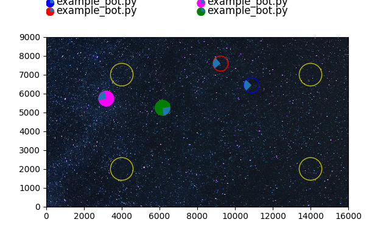
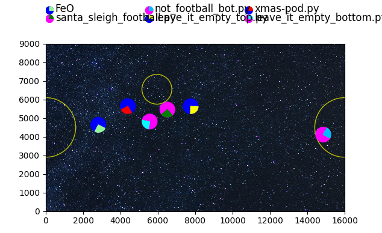

Intro
==========================================

Game inspired by the excelent game of 'Mad Podracing: Coders Strike Back' by www.codingame.com

Tries to recreate some of the same concepts, but locally executed to allow for a bit more control
and to run competitions manually. 

Run
==========================================

Run program by `python3 main.py <path_to_your_bod>`.

Alternatively run `python3 main.py --help` for more options.

Other links and notes
==========================================

- Walkthrough of solutions - has lots of simulation and level info
  https://tcourreges.github.io/coders-strike-back
